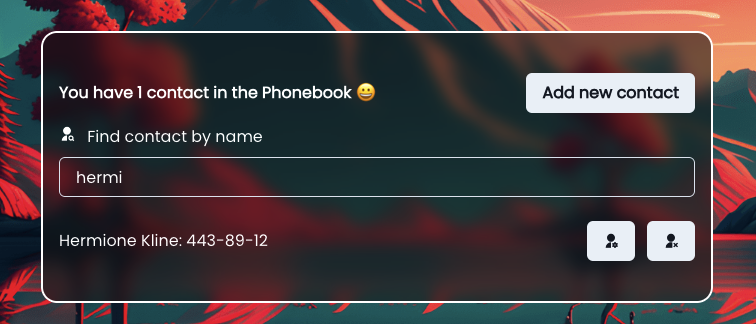

# Welcome to Phonebook!

Phonebook is a convenient and user-friendly application designed to organize
your personal phonebook. With our app, you can store, manage, and quickly find
all your contacts.

The main page of Phonebook provides access to two essential features: Sign Up
and Log in. This allows users to either create a new account or log in with
their existing credentials. Upon successful login, you will be redirected to the
Contacts page.

On the Contacts page, you can start building your own phonebook. Add new
contacts, including names, phone numbers, and other relevant information.
Furthermore, Phonebook allows you to edit, delete, and update your contacts to
ensure you always have up-to-date information.

To find a specific contact, utilize the search function by name. Simply enter
the contact's name in the search field, and you can quickly locate the desired
contact. This enables you to efficiently manage your phonebook and find the
contacts you need at any given moment.

Phonebook is your reliable assistant for storing and organizing all your
contacts. Join us today and enjoy the convenience and efficiency of our
Phonebook app!

If you have any questions or require further assistance, please don't hesitate
to contact our support team. Thank you for choosing Phonebook!
